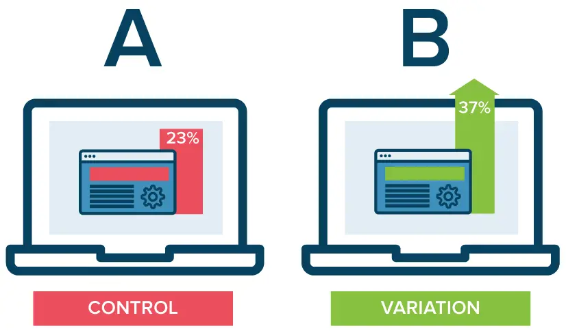

# Data Science A/B Testing Project - Readme

This project is an analysis of an A/B testing experiment conducted on an e-commerce website to evaluate the effectiveness of a new landing page design. The goal of the experiment was to determine if the new landing page design would result in a statistically significant increase in the conversion rate.

## Experiment Details
The visitors to the website were randomly assigned to either the control group or the treatment group. The control group was shown the existing landing page, while the treatment group was shown the new landing page design.

The conversion rate was measured as the proportion of visitors who completed a desired action.

## Hypothesis Testing
We formulated the following hypotheses:

* Null Hypothesis: The new landing page design has no impact on the conversion rate.
* Alternative Hypothesis: The new landing page design has a positive impact on the conversion rate.

To test these hypotheses, we used a one-tailed z-test with a significance level of 0.05. The z-test assumes that the sample means are normally distributed, which is appropriate for our sample size.

## Logistic Regression Analysis
In addition to the hypothesis test, we also conducted a logistic regression analysis to evaluate the impact of the new landing page design on the conversion rate. The logistic regression model included the following independent variables:

* Group (control or treatment)
* User country

The dependent variable was the binary outcome of whether or not the user completed the desired action.

## Conclusion
After conducting the hypothesis test and logistic regression analysis, we concluded that there is not enough evidence to reject the null hypothesis. That is, there is no statistically significant difference in the conversion rate between the control group and treatment group. This suggests that the new landing page design does not have a positive impact on the conversion rate.

